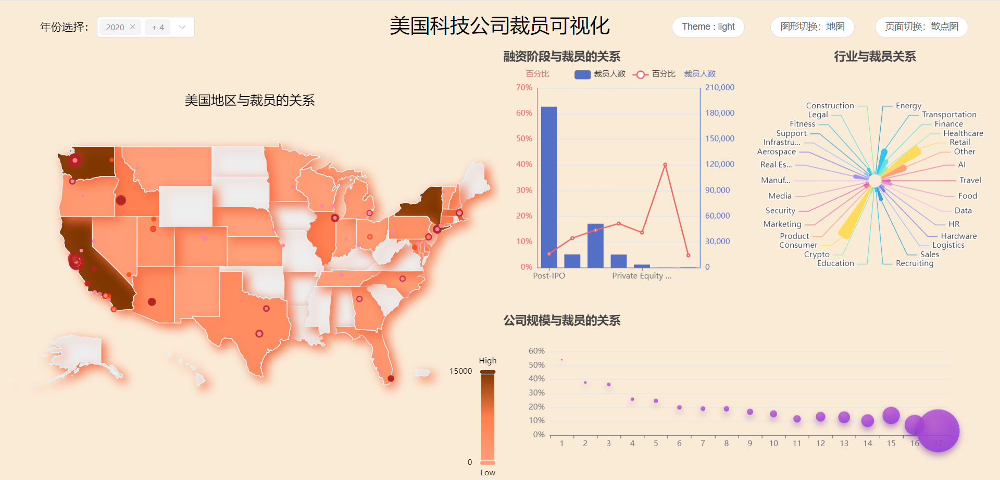
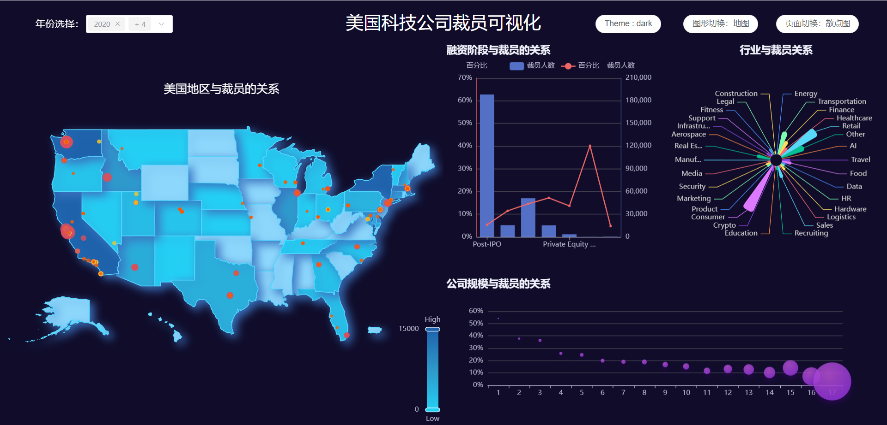
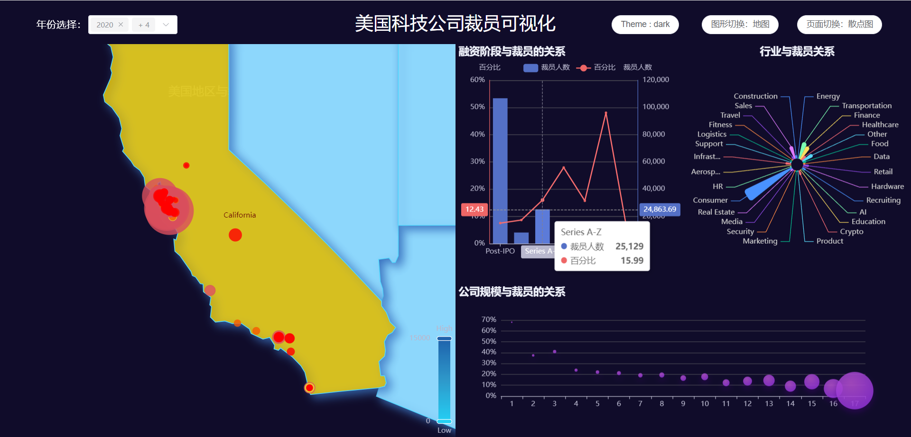

# **项目简介**

#### 项目介绍：

​	BIT可视化课程项目。近些年一直有关于科技公司裁员的报道，故寻找相关数据集进行可视化，更加形象直观的展现美国公司裁员的数量、比例与公司、地区、行业、规模和融资阶段的关系，使用vue.js和echarts进行页面制作。

#### 项目预览：







#### **项目运行：**

## Recommended IDE Setup

[VSCode](https://code.visualstudio.com/) + [Volar](https://marketplace.visualstudio.com/items?itemName=Vue.volar) (and disable Vetur).

## Customize configuration

See [Vite Configuration Reference](https://vitejs.dev/config/).

## Project Setup

```sh
pnpm install
```

### Compile and Hot-Reload for Development

```sh
pnpm dev
```

### Compile and Minify for Production

```sh
pnpm build
```

### Lint with [ESLint](https://eslint.org/)

```sh
pnpm lint
```
